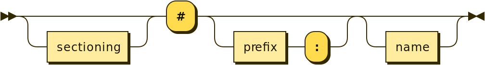
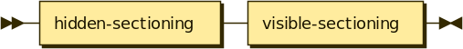

Numbering
---------

Each paragraph or the first line of a description list ended by a
**numbering-marker** will be numbered. The **description** preceding the
**numbering-marker** can be used as a **category** name by converting it
to an auto-identifier. There can be an optional **title** enclosed in
parentheses between the **description** and the **numbering-marker**.

Thus the syntax for **automatic-numbering** is:

.. image:: images/automatic-numbering.png

where:

-  **description-category** is a significant text (i.e. ``Exercise``)
-  **title** is a optional title text enclosed in parentheses
   (i.e. ``(This is the first exercise)``)
-  **numbering-marker** is a special string mainly containing a ``#``
   character (preceded by an optional **sectioning** part and followed
   by an optional **prefix** part and an optional **name** part). If
   there is a **prefix** part, the **category** is set to that
   **prefix** part.

When a new (**category**, **sectioning**) couple is parsed, a new
counter is set to 1. This counter is used to number this paragraph and
all the paragraphs which use the same couple.

Thus:

.. code-block:: md

   Exercise #

   Exercise #
   :   Text for the exercise

will be rendered as

.. code-block:: md

   **Exercise 1**

   **Exercise 2**
   :   Text for the exercise

The optional **title** will be rendered at the end of the paragraph.
Thus:

.. code-block:: md

   Exercise (This is the first exercise) #

   Exercise (This is the second exercise) #

will be rendered as

.. code-block:: md

   **Exercise 1** *(This is the first exercise)*

   **Exercise 2** *(This is the second exercise)*

The syntax for a **numbering-marker** is:

The optional **sectioning** part is composed of a **hidden-sectioning**
part and of a **visible-sectioning** part.

The **hidden-sectioning** part is composed of an optional sequence of
``-.`` characters

The **visible-sectioning** part is composed of an optional sequence of
``+.`` characters.

The **sectioning** part is used to

-  reset the count number for a given **category** when the headers
   change.
-  number the paragraphs.

Thus, if you use the **visible-sectioning** part:

.. code-block:: md

   First section
   =============

   Exercise +.#

   Exercise +.#

   Second section
   ==============

   Exercise +.#

   Exercise +.#

will be rendered as

.. code-block:: md

   First section
   =============

   **Exercise 1.1**

   **Exercise 1.2**

   Second section
   ==============

   **Exercise 2.1**

   **Exercise 2.2**

If you use the **hidden-sectioning** part, the header numbers are not
shown. Thus:

.. code-block:: md

   First section
   =============

   Exercise -.#

   Exercise -.#

   Second section
   ==============

   Exercise -.#

   Exercise -.#

will be rendered as

.. code-block:: md

   First section
   =============

   **Exercise 1**

   **Exercise 2**

   Second section
   ==============

   **Exercise 1**

   **Exercise 2**

Note that the second section has reset the exercises’ numbering that use
the ``-.`` sectioning part.

If you use the **hidden-sectioning** part and the **visible-sectioning**
part:

.. code-block:: md

   First section
   =============

   First sub-section
   -----------------

   Exercise -.+.#

   Exercise -.+.#

   Second sub-section
   -----------------

   Exercise -.+.#

   Exercise -.+.#

   Second section
   ==============

   First sub-section
   -----------------

   Exercise -.+.#

   Exercise -.+.#

   Second sub-section
   -----------------

   Exercise -.+.#

   Exercise -.+.#

will be rendered as:

.. code-block:: md

   First section
   =============

   First sub-section
   -----------------

   **Exercise 1.1**

   **Exercise 1.2**

   Second sub-section
   ------------------

   **Exercise 2.1**

   **Exercise 2.2**

   Second section
   ==============

   First sub-section
   -----------------

   **Exercise 1.1**

   **Exercise 1.2**

   Second sub-section
   ------------------

   **Exercise 2.1**

   **Exercise 2.2**

For the examples given above, the real rendering is more complex. The
paragraphs are enclosed in a ``span`` element whose identifier is
constructed using the **category**, the **sectioning**, the **prefix**
and the **name**. This can be used to cross-refer these numbered
paragraphs.

The last example is really rendered as:

.. code-block:: md

   First section
   =============

   First sub-section
   -----------------

   [**Exercise 1.1**]{#exercise:1.1.1 .pandoc-numbering-text .exercise}

   [**Exercise 1.2**]{#exercise:1.1.2 .pandoc-numbering-text .exercise}

   Second sub-section
   ------------------

   [**Exercise 2.1**]{#exercise:1.2.1 .pandoc-numbering-text .exercise}

   [**Exercise 2.2**]{#exercise:1.2.2 .pandoc-numbering-text .exercise}

   Second section
   ==============

   First sub-section
   -----------------

   [**Exercise 1.1**]{#exercise:2.1.1 .pandoc-numbering-text .exercise}

   [**Exercise 1.2**]{#exercise:2.1.2 .pandoc-numbering-text .exercise}

   Second sub-section
   ------------------

   [**Exercise 2.1**]{#exercise:2.2.1 .pandoc-numbering-text .exercise}

   [**Exercise 2.2**]{#exercise:2.2.2 .pandoc-numbering-text .exercise}

The **prefix** and **name** parts are composed of a letter followed by
any number of letter, digit, ``.`` and ``-`` characters.

-  If the optional **prefix** and **name** parts are present, the
   identifier of the ``span`` element is set using the **prefix** and
   **name** parts.

   .. code-block:: md

      Section
      =======

      Subsection
      ----------

      Exercise -.+.#myprefix:myid

   will be rendered as

   .. code-block:: md

      Section
      =======

      Subsection
      ----------

      [**Exercise 1.1**]{#myprefix:myid .pandoc-numbering-text .myprefix}

-  If the optional **prefix** part is present without the **name** part,
   the identifier of the ``span`` element is set using the **prefix**
   part followed by the full numbering of the paragraph.

   .. code-block:: md

      Section
      =======

      Subsection
      ----------

      Exercise -.+.#myprefix:

   will be rendered as

   .. code-block:: md

      Section
      =======

      Subsection
      ----------

      [**Exercise 1.1**]{#myprefix:1.1.1 .pandoc-numbering-text .myprefix}

-  If the optional **name** part is present without the **prefix** part,
   the identifier of the ``span`` element is constructed using the
   auto-identifier of the **category** followed by a ``:`` character and
   by the **name** part

   .. code-block:: md

      Section
      =======

      Subsection
      ----------

      Exercise -.+.#myid

   will be rendered as

   .. code-block:: md

      Section
      =======

      Subsection
      ----------

      [**Exercise 1.1**]{#exercise:myid .pandoc-numbering-text .exercise}

-  If there is no **name** and **prefix** parts, the identifier of the
   ``span`` element is constructed using the conversion of the
   **description** into an auto-identifier (**category**) followed by a
   ``:`` character and by the full numbering of the paragraph (see
   preceding example). For the auto-identifier conversion:

   -  all accents are removed
   -  characters which are not a letter, a digit or a ``-`` character
      are replaced by a ``-`` character
   -  all beginning characters which are not a letter are removed
   -  all letters are converted to lowercase

